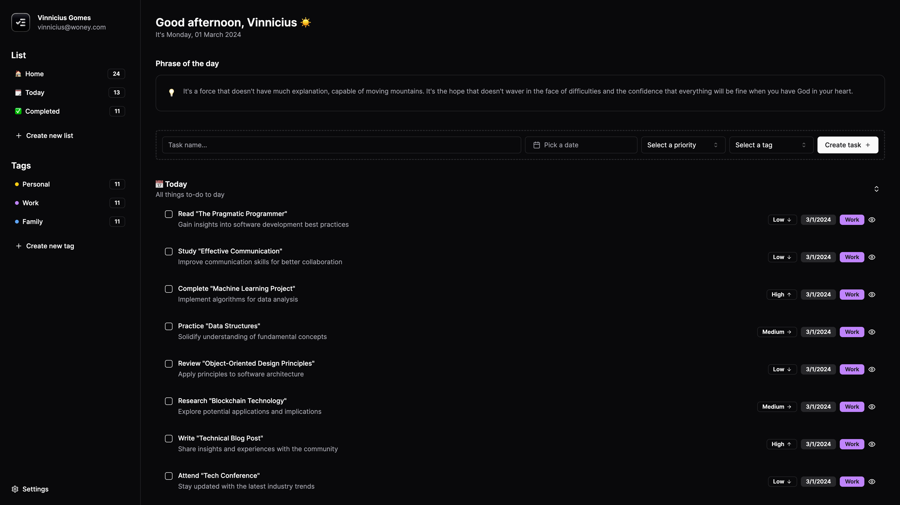

<p align="center">
  
</p>

<h1 align="center">
  DevToDo - To-do list application for developers 🚧
</h1>

<p align="center">
  
</p>


DevToDo is a to-do list application developed specifically to meet the needs of developers. It offers a simple and effective way to manage tasks, projects, and software development goals.

## Features

- [ ] **Task Management:** Easily add, edit, and delete tasks. Mark tasks as complete or incomplete and prioritize your activities.
- [ ] **Integration with Development Tools:** Sync tasks with project management platforms like GitHub, GitLab, Trello, Jira, among others.
- [ ] **Multi-device Support:** Access your tasks anywhere, either through the mobile app (PWA) or the web application.
- [ ] **Customization and Flexibility:** Add tags or labels to tasks, filter and search tasks easily, and customize the interface according to your preferences.
- [ ] **Integration with Productivity Tools:** Receive reminders and personalized notifications for your tasks, and integrate with calendar apps to track deadlines.
- [ ] **Collaboration and Sharing:** Share task lists with team members, assign tasks, and comment on specific activities.
- [ ] **Analytics and Reports:** Analyze your personal productivity, track project progress, and visualize data through charts and reports.
- [ ] **Security and Privacy:** Protect your data with encryption and control who can access and modify your tasks.

---

This is a [Next.js](https://nextjs.org/) project bootstrapped with [`create-next-app`](https://github.com/vercel/next.js/tree/canary/packages/create-next-app).

## Getting Started

First, run the development server:

```bash
npm run dev
# or
yarn dev
# or
pnpm dev
# or
bun dev
```

Open [http://localhost:3000](http://localhost:3000) with your browser to see the result.

You can start editing the page by modifying `app/page.tsx`. The page auto-updates as you edit the file.

This project uses [`next/font`](https://nextjs.org/docs/basic-features/font-optimization) to automatically optimize and load Inter, a custom Google Font.

## Learn More

To learn more about Next.js, take a look at the following resources:

- [Next.js Documentation](https://nextjs.org/docs) - learn about Next.js features and API.
- [Learn Next.js](https://nextjs.org/learn) - an interactive Next.js tutorial.

You can check out [the Next.js GitHub repository](https://github.com/vercel/next.js/) - your feedback and contributions are welcome!

## Contribuição

Contribuições são bem-vindas! Se você encontrar algum problema ou tiver alguma sugestão de melhoria, sinta-se à vontade para abrir uma issue ou enviar um pull request.

## Licença

Este projeto está licenciado sob a Licença MIT. Para mais detalhes, consulte o arquivo [LICENSE](LICENSE).
